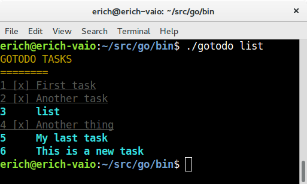

# A simple TODO app written in go.

[](https://travis-ci.org/ericho/gotodo)
[](https://coveralls.io/github/ericho/gotodo?branch=master)

This is a simple command line application to track TODO tasks. gotodo creates a file under home directory called .gotodo.txt to store all the tasks. Every task has an id which will be used to mark the task as done. 



## Installation

Requirements:
Install Colourize package from https://github.com/TreyBastian/colourize
``` 
go get github.com/TreyBastian/colourize
```

Get the source code and install.
```
go get github.com/ericho/gotodo
go install
```

## Usage

gotodo is very simple, for adding a new task run:
```
gotodo add "This is my new task"
```
To see the list of the tasks run:
```
gotodo list
```
When a task is done, you can mark this task with:
```
gotodo done 1
```
where is the id number of the task

To start over with all the tasks just run:
```
gotodo clear
```

## TODO

* A refactor is needed, there are some repeated functions
* Coverage is like 58%, that's not good in a project so small like this. 

## Bugs
A LOT!
